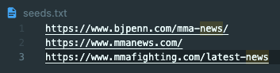
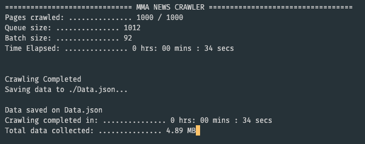

# CS172-Group-Project

**Team**: Bryan Guevara, Patrick Fenn, Thet Zaw, Harris shepard

## Dependencies
* curses
* bs4

## Instructions
To run the crawler follow these instructions
1. Make sure you are connected to the internet
2. Navigate to the folder containing the `general-threaded-crawler.py` file
3. Create a `.txt` file with the seed links for the crawler (if not already there)

4. Run the command `source exec.sh <max_pages> <max_threads> <url_threshold> <path_to_seed_file>`
* Example: `source exec.sh 1000 100 100 ./seeds.txt `

## Sample Output
